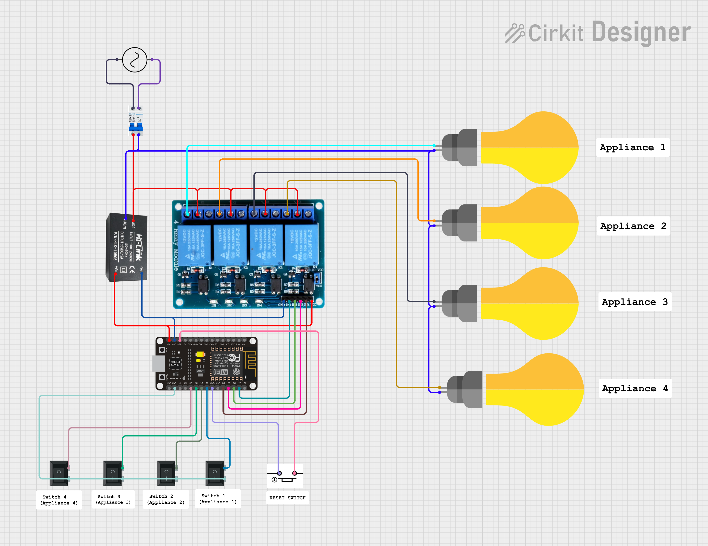

# Home-Automation
Convert Simple home and appliances smart without sacrificing physical switches.
Here’s a **clean, professional GitHub README.md file** based on your circuit, code, and documents:

---

# 🏠 Smart Home Automation using ESP8266 + Relay

### (Arduino Cloud + Google Home + Manual Switch Sync)

---

## 📌 Project Overview

This project is a **smart home automation system** that allows users to control appliances using **Google Home (voice control)**, **Arduino Cloud (remote control)**, and **physical switches (manual control)** — all synchronized in real-time.

Unlike traditional systems, this solution ensures **no mismatch between switch state and app state**, providing a seamless and reliable user experience.

---

## 🚀 Features

* 🔊 Voice control using Google Home
* 🌐 Remote access via Arduino Cloud
* 🔘 Manual switch control (works without internet)
* 🔄 Real-time state synchronization
* 💡 Control up to 4 appliances
* 💰 Low-cost and easy to install
* ⚡ Energy-efficient operation

---

## 🧠 How It Works

The system uses an ESP8266 microcontroller connected to a **4-channel relay module**. The ESP8266 receives commands from Arduino Cloud (linked with Google Home) and controls relays accordingly. At the same time, physical switches are connected to GPIO pins, allowing manual control.

The relay acts as a bridge between **low-voltage ESP8266 (3.3V)** and **high-voltage AC appliances**, ensuring safe operation. 

A **state-based logic system** ensures that both manual switches and cloud control always remain synchronized. 

---

## 🔧 Hardware Components

* ESP8266 (NodeMCU)
* 4-Channel Relay Module
* 4 × Manual Switches
* Power Supply (5V)
* Connecting Wires
* AC Appliances (Bulbs, Fan, etc.)

---

## 🔌 Circuit Diagram



> The circuit connects ESP8266 GPIO pins to relay inputs and switches, while the relay controls AC appliances safely.

---

## ⚙️ Circuit Connections

### 🔹 ESP8266 → Relay Module

| ESP8266 Pin | Relay Input |
| ----------- | ----------- |
| D1          | IN1         |
| D2          | IN2         |
| D5          | IN3         |
| D6          | IN4         |

* VCC → 5V
* GND → Common Ground

---

### 🔹 Switch Connections

| Switch | ESP8266 Pin |
| ------ | ----------- |
| SW1    | D3          |
| SW2    | D4          |
| SW3    | D7          |
| SW4    | D8          |

---

### 🔹 Relay → Appliance

* COM → Live wire input
* NO → Appliance
* Neutral → Direct connection

---

## 📲 Software & Integration

* Arduino IDE / Arduino Cloud
* Google Home (via Arduino Cloud integration)
* ESP8266 Wi-Fi connectivity

---

## 💻 Code

The Arduino code is available in:

```
Code.ino
```

It handles:

* Wi-Fi connection
* Arduino Cloud variables
* Relay control
* Switch input detection
* State synchronization

---

## ⚠️ Safety Precautions

* ⚡ Handle AC power carefully
* 🔌 Always disconnect power while wiring
* 🧰 Use insulated wires
* 🔒 Prefer opto-isolated relay modules

---

## 🌍 Applications

* Smart homes
* Hostels & PG automation
* Offices
* Energy-saving systems

---

## 🔮 Future Scope

* 📊 Energy monitoring using current sensors
* 🤖 AI-based automation (predict user behavior)
* 🌐 ESP Mesh networking for large areas
* 🔊 Integration with Alexa & other ecosystems
* 📱 Custom mobile app dashboard

---

## 👨‍💻 Team

**DryRunners – Hackathon Team 2026**

* Shivam
* Amitoz Singh
* Ansh Kumar
* Yashraj
* Arjun Singh

---

## 🏆 Why This Project?

This project solves a **real-world problem** by eliminating the mismatch between traditional switches and smart systems. It provides a **hybrid solution** that is practical, affordable, and scalable. 

---

## 📩 Contact

📧 [yash542109@gmail.com](mailto:yash542109@gmail.com)

---


